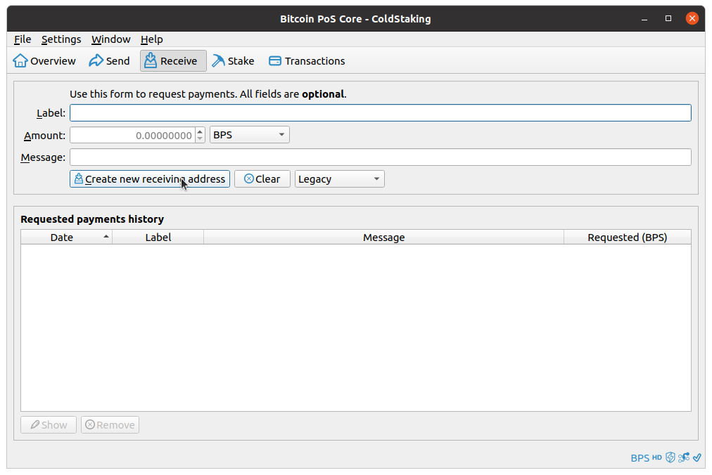
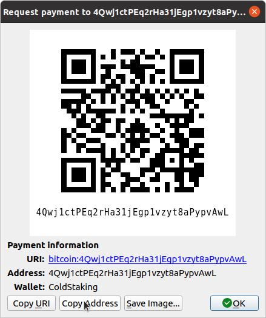
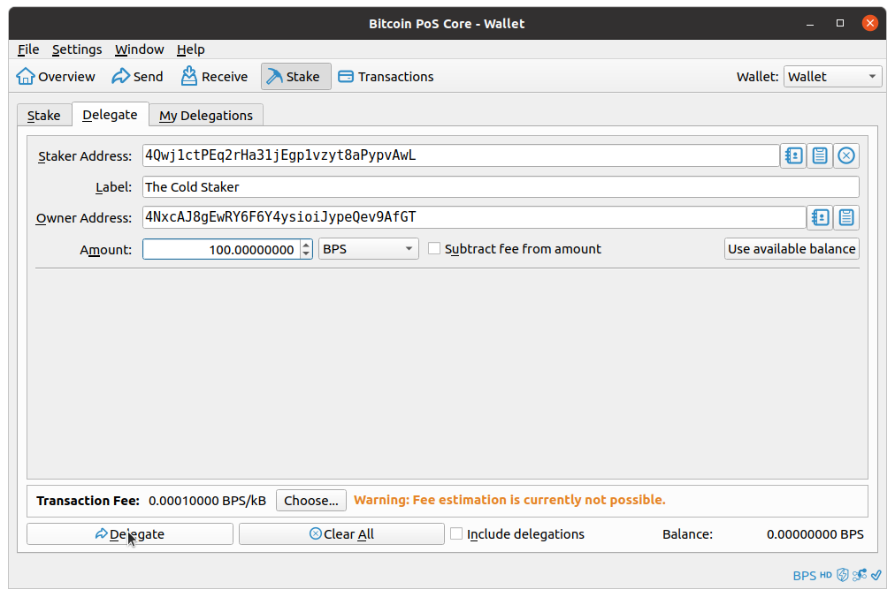
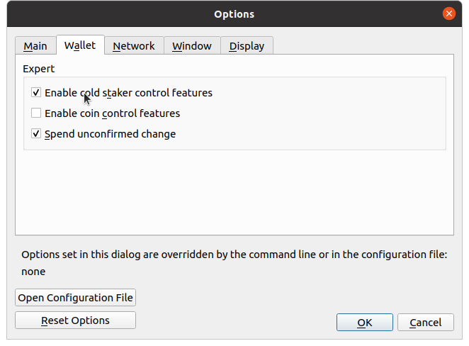
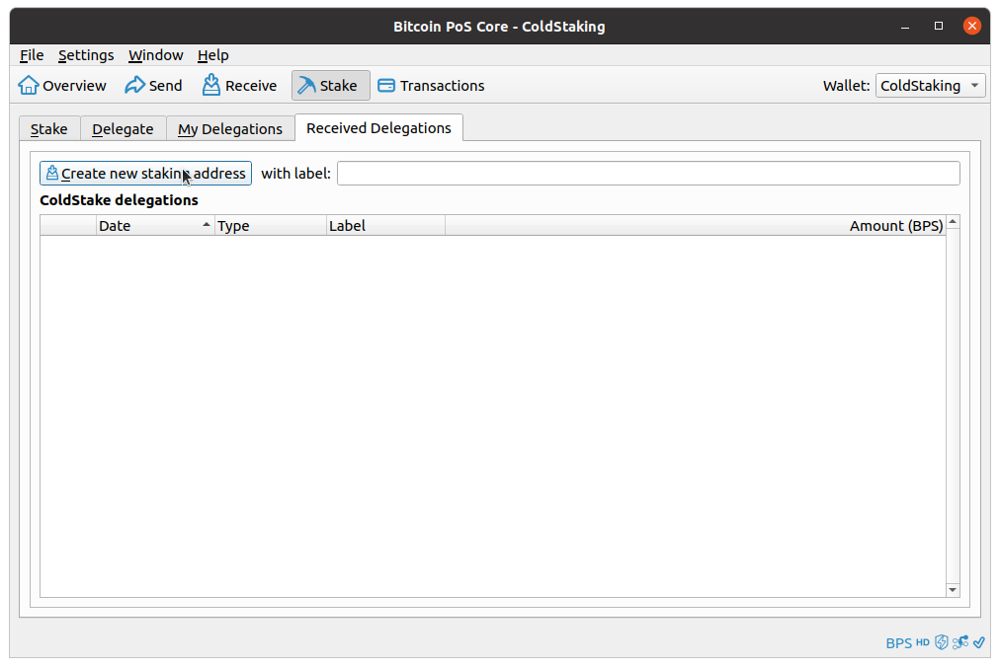

# BitcoinPoS Cold Staking How-To

__Cold staking involves two BitcoinPoS wallets:__
- one to hold the funds (this can be also a hardware wallet and does not need to be always online)
- one to handle the staking, the hot-node, (this needs to be online 24/7)

<p>In order to setup cold-staking, you need to perform the following steps (either with the command line interface, or with the graphical interface):</p>

1) [Get the "staker address" from the staker wallet](#1) (or from a 3rd party if they are doing the staking).

2) [Generate an "owner address" in the current wallet](#2) (a regular address, you should have one already).

3) [Create a "cold stake delegation"](#3).

- [Staker extra controls](#staker)
- [Additional RPC functions](#rpc)

<br>

### 1) <a name="1"></a>Getting a "staker address" from the staker wallet

Staker addresses are regular addresses owned by the __staker__ wallet (the one that is online 24/7).
The staker address cannot be in the same wallet as the owner address.

*CLI*
>To get a new staker address, from the staker wallet, do:
```
bitcoin-pos-cli getnewaddress
```
>You don't need to create a new staker address for each delegation. You can reuse your previously generated addresses.

<br>

*GUI*
>To create a staker address, from the Receive tab click "Create new receiving address"
<br><br><br><br>
The new address gets visualized, along with a QR-code.<br>
<br><br><br><br>
You can copy the address to paste it during the delegation (see point n.3).<br>
You don't need to create a new staking address for each delegation. You can reuse your previously generated addresses.

<br>

### 2) <a name="2"></a>Generate a "owner address" from the owner wallet

Owner addresses are regular BitcoinPoS addresses owned by the __owner__ wallet (the wallet doing the delegation). The private keys of these addresses can be used to redeem the delegated coins.

The process for creating an owner address is identical to the one from the staker address (see above).

<br>

### 3) <a name="3"></a>Create a "cold stake delegation"

This is the main step.<br>
To delegate coins you need to send a special "delegation contract" transaction.

*CLI*
>Specify the staker address, the owner address and the amount to delegate:
```
bitcoin-pos-cli delegatestake "4Qwj1ctPEq2rHa31jEgp1vzyt8aPypvAwL" "4NxcAJ8gEwRY6F6Y4ysioiJypeQev9AfGT" 1000
```

<br>

*GUI*
>From the Stake tab, Delegate sub-tab<br>
As with the regular sending operation, you must select an amount and either let the wallet pick the coins, or select them with coin control.<br>
Insert the staker address (or select it from the list of previously used ones), a description, and the owner address.<br>
Then click "Delegate".<br>
<br><br>

The delegations will be visible in the My Delegations sub-tab.

<br>

### <a name="staker"></a>Staker extra controls

>For stakers, some extra controls can be enabled from the Settings -> Options -> Wallet section<br>
<br><br><br><br>
An extra sub-tab will be shown in the Stake tab which will display the received delegations and have a shortcut for creating addresses faster<br>
<br><br>

### <a name="rpc"></a>Additional RPC functions

These are other JSON-RPC calls accessible via console or `bitcoin-pos-cli`.<br>
Check the help for more info on each one.<br>
- `getwalletinfo`
- `listunspentdelegations`

<br>